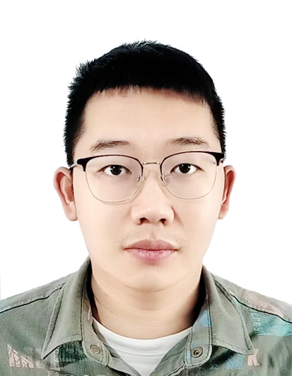

# Zheng He

**Doctoral Candidate (Dr. med.)**

🏛 [Starkuvienė Lab](https://www.bioquant.uni-heidelberg.de/groups/starkuviene), BioQuant, Heidelberg University · Heidelberg 
🏥 Medizinische Fakultät Mannheim, Heidelberg University · Mannheim

*Supervised by Prof. Dr. med. Michael Keese & Prof. Dr. Vytautė Starkuvienė-Erfle* 
*Doktorvater: PD Dr. med. Martin Sigl*

<a href="mailto:zheng.he@bioquant.uni-heidelberg.de" class="btn btn-primary btn-sm">✉ zheng.he@bioquant.uni-heidelberg.de</a>
<a href="mailto:hezheng.surgeon@gmail.com" class="btn btn-outline-secondary btn-sm">✉ hezheng.surgeon@gmail.com</a>
<a href="https://scholar.google.com/citations?user=oPz_JBcAAAAJ" class="btn btn-outline-secondary btn-sm" target="_blank">🎓 Google Scholar</a>
<a href="https://orcid.org/0000-0002-0374-0368" class="btn btn-outline-secondary btn-sm" target="_blank">ORCID</a>
<a href="https://github.com/zhenghe-research" class="btn btn-outline-secondary btn-sm" target="_blank">GitHub</a>

---

My doctoral research spans three interconnected lines of investigation, combining computational transcriptomics, quantitative imaging, and experimental cell biology.

**VSMC phenotypic plasticity** — My primary project investigates the transcriptional basis of vascular smooth muscle cell (VSMC) phenotypic switching — the transition between a quiescent contractile state and a proliferative synthetic state central to atherosclerosis and in-stent restenosis. The work combines donor-aware computational analyses of public human aortic SMC transcriptomic data with experimental validation in primary human aortic SMCs, integrating perturbation transcriptomics, single-cell anchoring to human plaque states, and wet-lab perturbation models to interrogate the functional identity of the switching program.

**ABCB5⁺ MSCs & chronic wound healing** — A second line of research concerns ABCB5⁺ MSCs — a rare population of skin-derived stromal cells with immunomodulatory and regenerative properties. Beyond a published review (*Journal of Clinical Medicine*, 2025), I am leading a multi-modal bioinformatics study integrating expression-based paracrine candidate identification, chronic wound transcriptome profiling, single-cell contextualization, cell-cell communication analysis, and causal-inference methods, complemented by experimental co-culture studies of ABCB5⁺ MSC paracrine effects on wound-relevant cell populations.

**Endocytic trafficking in HeLa cells** — Working within the Starkuvienė Lab, I investigate endocytic pathway regulation in HeLa Kyoto cells using size-selective dextran-FITC uptake assays, pathway-specific pharmacological inhibition dissecting macropinocytic and dynamin-dependent endocytic contributions, 3D spheroid culture models, and wound healing migration assays. This work contributes to the lab's programme on the spatial and temporal regulation of intracellular trafficking and its dysregulation in disease and aging.

---

## Research Interests

**Vascular Biology**

VSMC phenotypic plasticity, contractile-to-synthetic transition, atherosclerosis, in-stent restenosis

**Computational Biology**

Bulk RNA-seq, scRNA-seq, WGCNA, GSVA, GSEA, Mendelian randomization, cell-cell communication analysis, molecular docking

**Stem Cell & Wound Biology**

ABCB5⁺ MSC paracrine biology, chronic wound repair, stem cell differentiation, endocytic pathway regulation, intracellular trafficking

---

## Selected Publications

He Z, Starkuviene V, Keese M. *The Differentiation and Regeneration Potential of ABCB5⁺ Mesenchymal Stem Cells: A Review and Clinical Perspectives.* **J Clin Med** 2025, 14(3), 660. · [DOI](https://doi.org/10.3390/jcm14030660)

He Z, Jiang Q, Li F, Chen M. *Crosstalk between venous thromboembolism and periodontal diseases: a bioinformatics analysis.* **Disease Markers** 2021, 1776567. · [DOI](https://doi.org/10.1155/2021/1776567)
